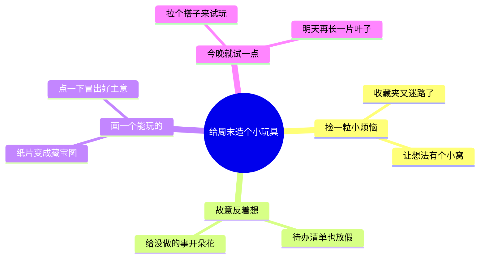

# 脑洞小剧场

```mermaid
mindmap
  root((给周末造个小玩具))
    捡一粒小烦恼
      收藏夹又迷路了
      让想法有个小窝
    故意反着想
      待办清单也放假
      给没做的事开朵花
    画一个能玩的
      纸片变成藏宝图
      点一下冒出好主意
    今晚就试一点
      拉个搭子来试玩
      明天再长一片叶子
```

原创故事范例，取自完整脑图的四个构思阶段；不是线性因果或商业结果承诺。
