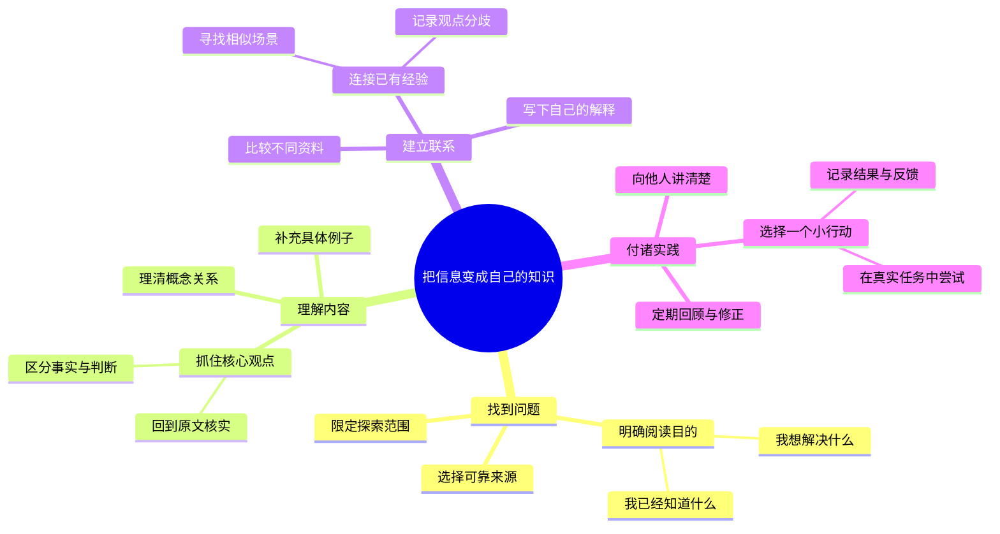

```mermaid
mindmap
  root((把信息变成自己的知识))
    找到问题
      明确阅读目的
        我想解决什么
        我已经知道什么
      选择可靠来源
      限定探索范围
    理解内容
      抓住核心观点
        区分事实与判断
        回到原文核实
      理清概念关系
      补充具体例子
    建立联系
      连接已有经验
        寻找相似场景
        记录观点分歧
      比较不同资料
      写下自己的解释
    付诸实践
      选择一个小行动
        在真实任务中尝试
        记录结果与反馈
      向他人讲清楚
      定期回顾与修正
```

## 来源说明

这是用于比较结构与主题的原创演示内容，不是对某篇文章的摘要，也不代表经过实证验证的学习方法。
