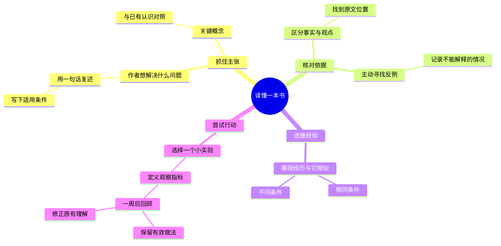

# 把一本书读成自己的知识

```mermaid
mindmap
  root((读懂一本书))
    抓住主张
      作者想解决什么问题
        用一句话复述
          写下适用条件
      关键概念
        与已有认识对照
    核对依据
      区分事实与观点
        找到原文位置
      主动寻找反例
        记录不能解释的情况
    连接经验
      哪段经历与它相似
        相同条件
        不同条件
    尝试行动
      选择一个小实验
        定义观察指标
          一周后回顾
            保留有效做法
            修正原有理解
```

示例：这是一个阅读方法演示，不代表来自某一本书的摘要。
