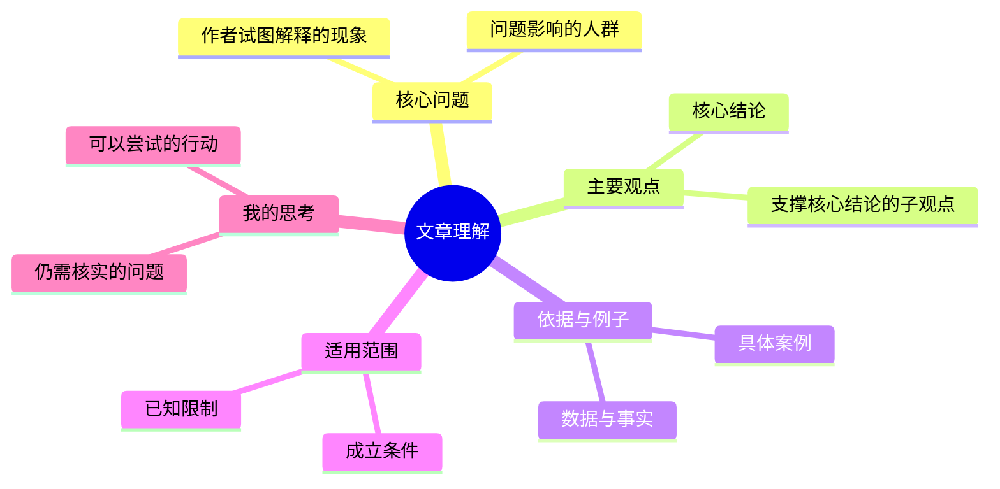

```mermaid
mindmap
  root((文章理解))
    核心问题
      作者试图解释的现象
      问题影响的人群
    主要观点
      核心结论
      支撑核心结论的子观点
    依据与例子
      数据与事实
      具体案例
    适用范围
      成立条件
      已知限制
    我的思考
      可以尝试的行动
      仍需核实的问题
```

## 来源说明

本文件为结构示例，未引用真实文章。生成实际导图时，以资料中的真实内容替换示例节点，删除不适用的分支，并记录来源。
