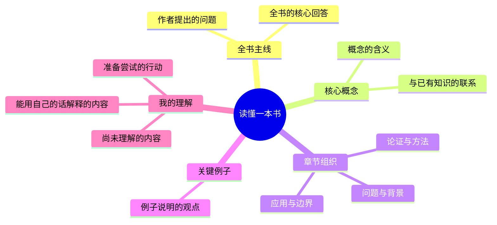

```mermaid
mindmap
  root((读懂一本书))
    全书主线
      作者提出的问题
      全书的核心回答
    核心概念
      概念的含义
      与已有知识的联系
    章节组织
      问题与背景
      论证与方法
      应用与边界
    关键例子
      例子说明的观点
    我的理解
      能用自己的话解释的内容
      尚未理解的内容
      准备尝试的行动
```

## 来源说明

本文件为结构示例，未引用真实书籍。生成实际导图时注明实际读取范围，仅在可确认时记录章节和页码。
