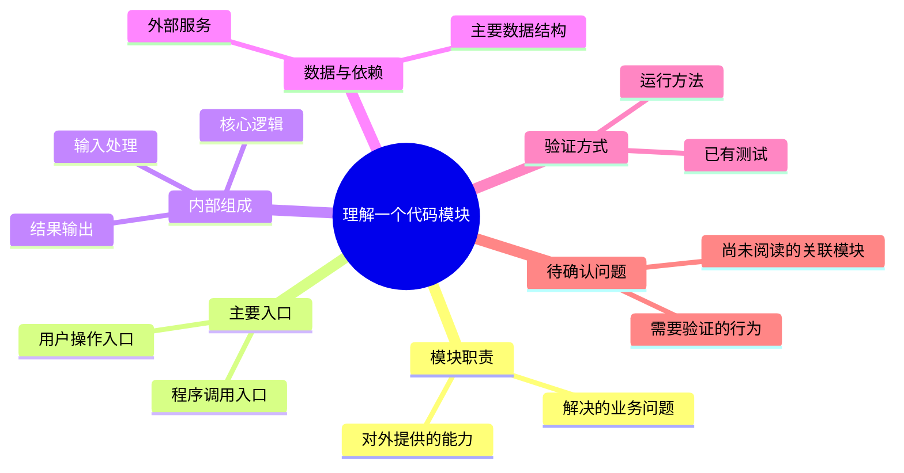

```mermaid
mindmap
  root((理解一个代码模块))
    模块职责
      解决的业务问题
      对外提供的能力
    主要入口
      用户操作入口
      程序调用入口
    内部组成
      输入处理
      核心逻辑
      结果输出
    数据与依赖
      主要数据结构
      外部服务
    验证方式
      已有测试
      运行方法
    待确认问题
      尚未阅读的关联模块
      需要验证的行为
```

## 来源说明

本文件为结构示例，未分析真实代码。实际使用时记录已查看的文件、符号及可核实的位置；层级仅表达组成关系，不表示调用顺序。
