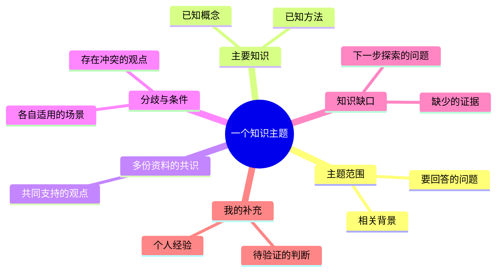

```mermaid
mindmap
  root((一个知识主题))
    主题范围
      要回答的问题
      相关背景
    主要知识
      已知概念
      已知方法
    多份资料的共识
      共同支持的观点
    分歧与条件
      存在冲突的观点
      各自适用的场景
    知识缺口
      缺少的证据
      下一步探索的问题
    我的补充
      个人经验
      待验证的判断
```

## 来源说明

本文件为结构示例。实际使用时逐项记录资料来源，区分资料事实、个人笔记与 AI 推断；无真实共识或分歧时删除相应分支。
